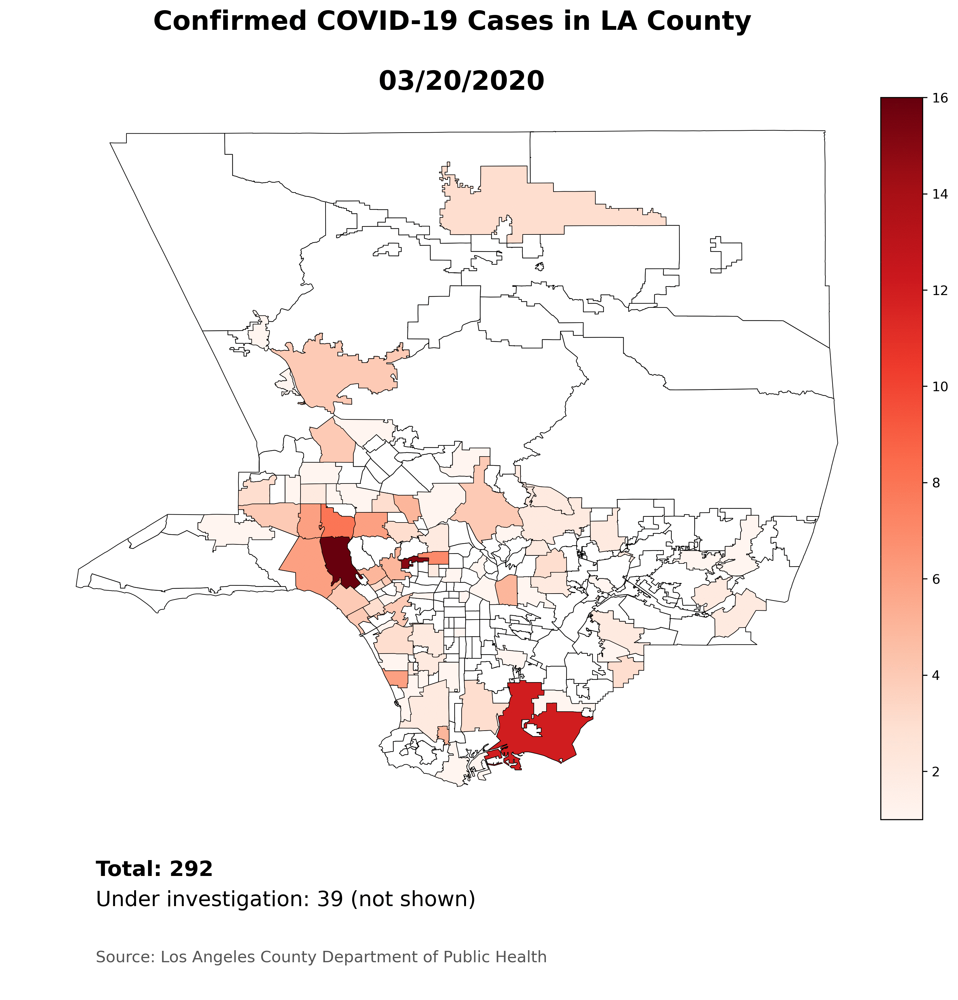

# covid_la
Charting the spread of COVID-19 across LA County

The Jupyter notebook creates a choropleth map of Los Angeles County, showing the case counts for COVID-19 by neighborhood.

Included are data files retrieved from the public health department website and saved as CSV files.  Note that the totals do not necessarily add up, and this is a direct transcription of values on the site.

Source:
* [LA County Department of Public Health: COVID-19 Locations](http://publichealth.lacounty.gov/media/Coronavirus/locations.htm)

* [LA Times: LA County Neighborhood Boundaries](http://boundaries.latimes.com/set/la-county-neighborhoods-current/)
